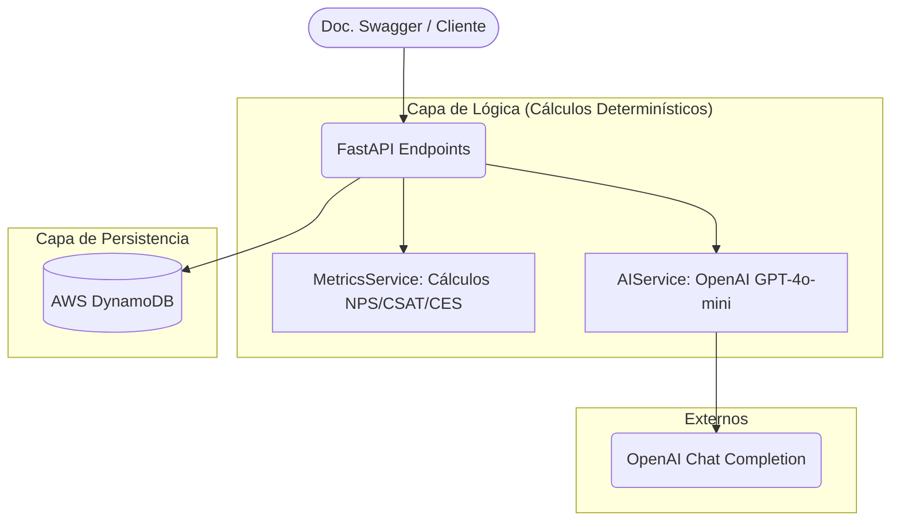

# Scoops XI - Experience Intelligence AI Backend 🍦🤖

Este servicio backend procesa feedback de clientes utilizando una arquitectura basada en **Cálculos Determinísticos**, donde las métricas son procesadas íntegramente en el backend y la IA se utiliza exclusivamente para generar insights estratégicos y accionables.

---

## 🏗️ Arquitectura del Sistema

El sistema sigue una arquitectura modular y escalable diseñada para la nube:



### Componentes:
- **FastAPI**: Framwork web de alto rendimiento.
- **AWS DynamoDB**: Base de datos NoSQL para escalabilidad masiva y baja latencia.
- **OpenAI Service**: Capa de inteligencia para transformación de datos en insights.
- **Structured Logging**: Logs en formato JSON para observabilidad profesional.

---

## 🛠️ Decisiones Técnicas

1.  **AWS DynamoDB**: Se eligió una base NoSQL sobre SQL por su capacidad de manejar picos de tráfico de feedback sin necesidad de gestionar servidores de base de datos tradicionales (Serverless).
2.  **OpenAI (JSON Mode)**: Forzamos a la IA a responder en JSON estructurado para asegurar que el backend pueda parsear y entregar resultados consistentes sin alucinaciones de formato.
3.  **Boto3 Direct Resource**: Se utiliza el recurso directo de Boto3 para mayor control sobre las operaciones en DynamoDB, permitiendo filtrados eficientes mediante `FilterExpression`.
4.  **Inhibición de Cálculos en LLM**: La IA **nunca** calcula promedios ni porcentajes. El backend entrega los datos agregados (NPS: -14, etc.), garantizando que las métricas financieras/operativas sean 100% precisas.

---

## 📌 Supuestos

- **Dataset Estático**: Se asume que el archivo `scoopsxi-dataset-20250123.json` es la fuente de verdad inicial y debe ser cargado para la evaluación.
- **Rango de Fechas**: Se asume que el usuario desea ver datos de Nov-Dic 2025 por defecto, aunque el sistema soporta cualquier rango.
- **NPS Integers**: Se asume que el NPS debe expresarse como un número entero (ej. -14 en lugar de -14.0) siguiendo los estándares de la industria y el ejemplo del PDF.
- **CSAT %**: Se asume que la métrica reina de CSAT es el porcentaje de satisfacción sobre el total, no solo la nota promedio.

---

## 🚀 Cómo Ejecutar el Proyecto

### Requisitos Previos:
- Python 3.10+
- Docker y Docker Compose (opcional para ejecución en contenedores)
- Credenciales de AWS y OpenAI en un archivo `.env`

### Opción A: Ejecución Local (Recomendado para desarrollo)

1.  **Clonar y Configurar**:
    ```bash
    cp .env.example .env
    # Edita .env con tus credenciales
    ```

2.  **Instalar Dependencias**:
    ```bash
    python -m venv .venv
    source .venv/bin/activate  # En Windows: .venv\Scripts\activate
    pip install -r requirements.txt
    ```

3.  **Ingesta de Datos**:
    ```bash
    python app/ingest_data.py
    ```

4.  **Iniciar Servidor**:
    ```bash
    uvicorn app.main:app --reload
    ```

### Opción B: Ejecución con Docker

```bash
docker-compose up --build
```

Accede a la documentación interactiva en: `http://localhost:8000/docs`

---

## 🧪 Tests

```bash
pytest tests/test_api_integration.py -v
```
